# NLP_LLM_Final_Project_py
you can access the FULL project at the following site : https://safwan188.github.io/LLMs_NLP_Project/new.html
# LLM Comparison Project

This project is designed to showcase the results of comparing different Large Language Models (LLMs) in  NLP task.
below are images based on the results we got

## Introduction

This project contains a series of images that display the results of comparing different LLMs in various NLP tasks using different prompts. Each image is labeled with a corresponding description to provide context and understanding.

## Images

###  Model Comparisons Using Different Prompts

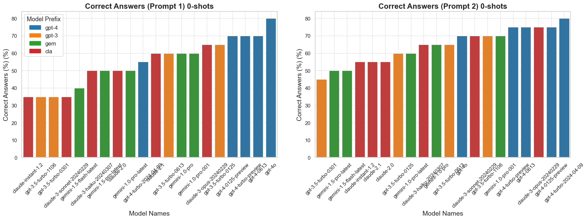

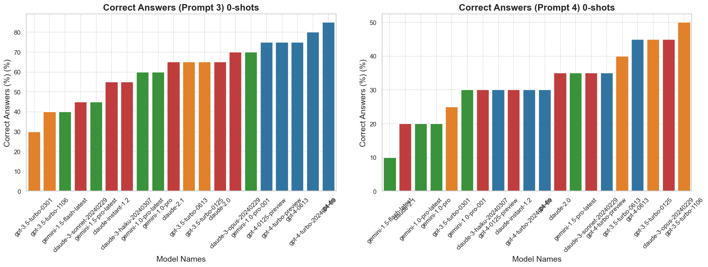

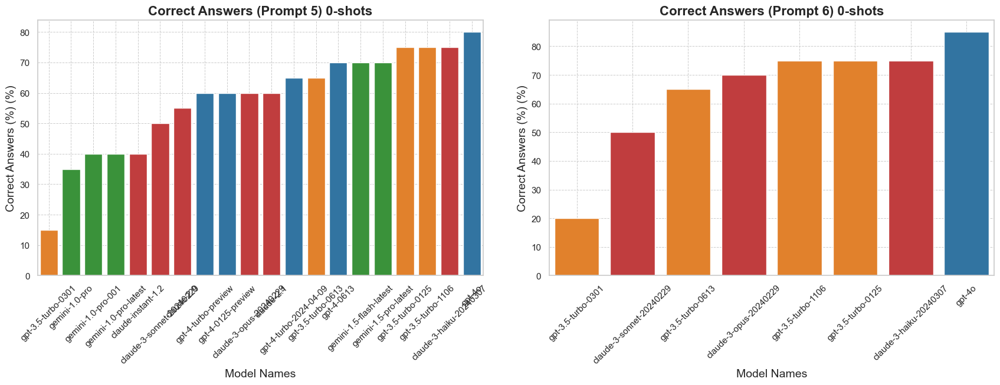

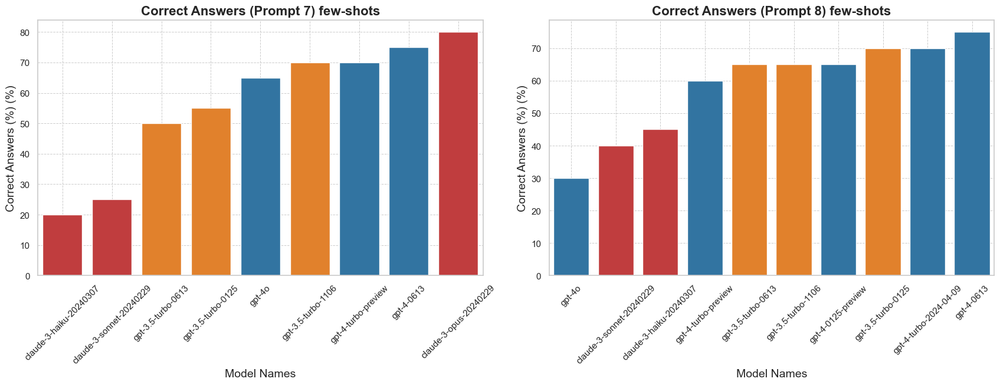

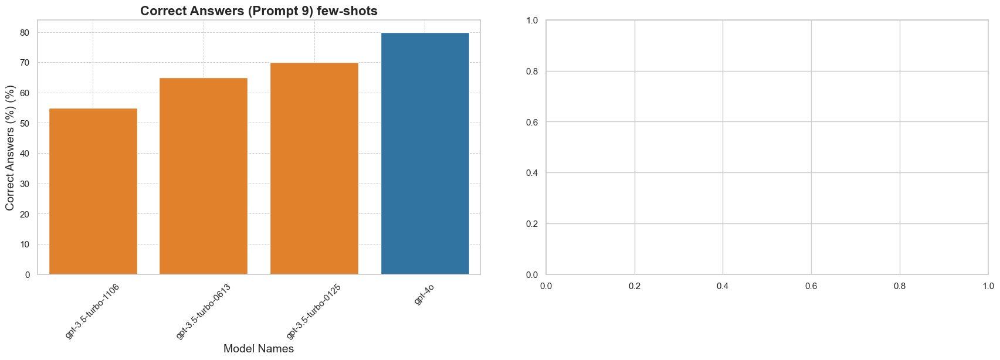

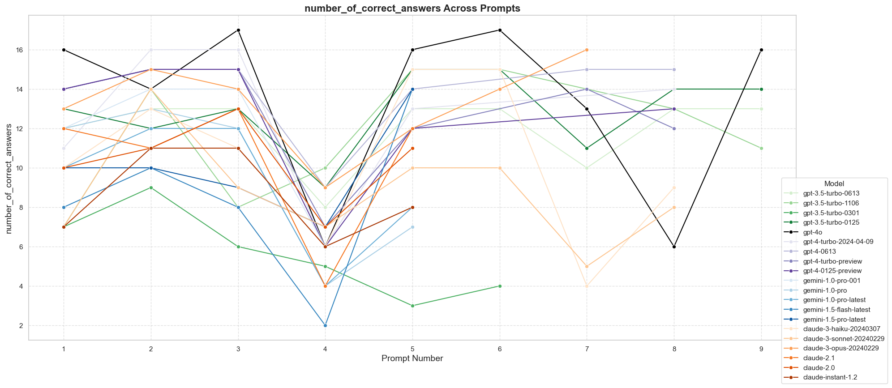

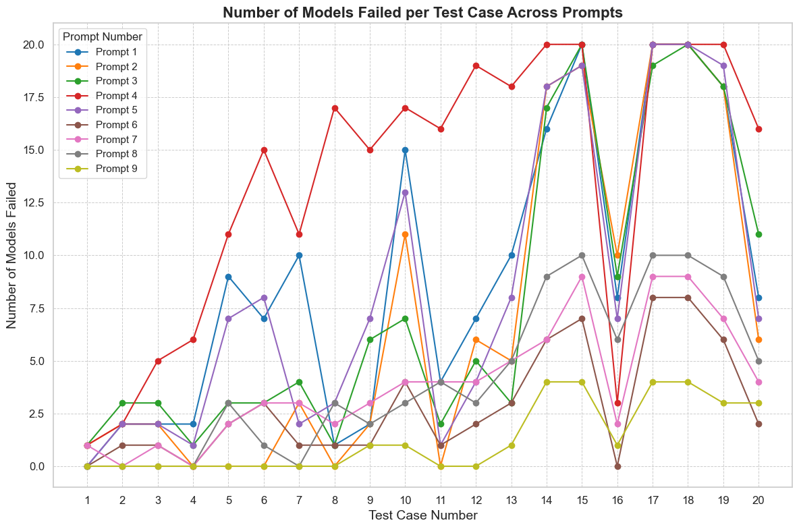

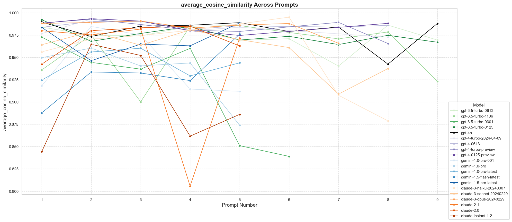

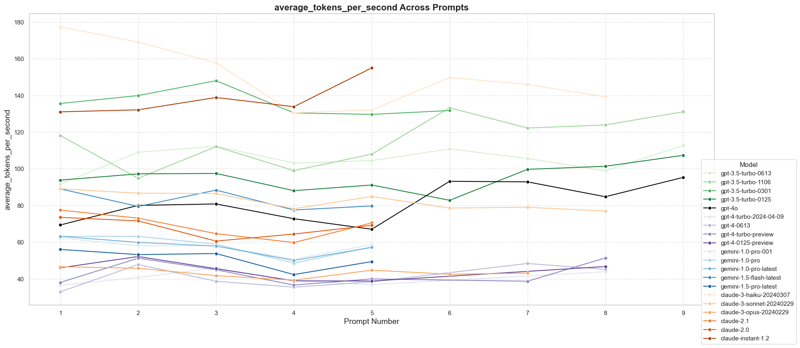

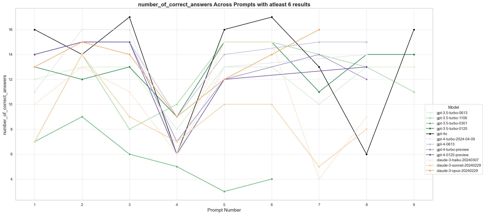

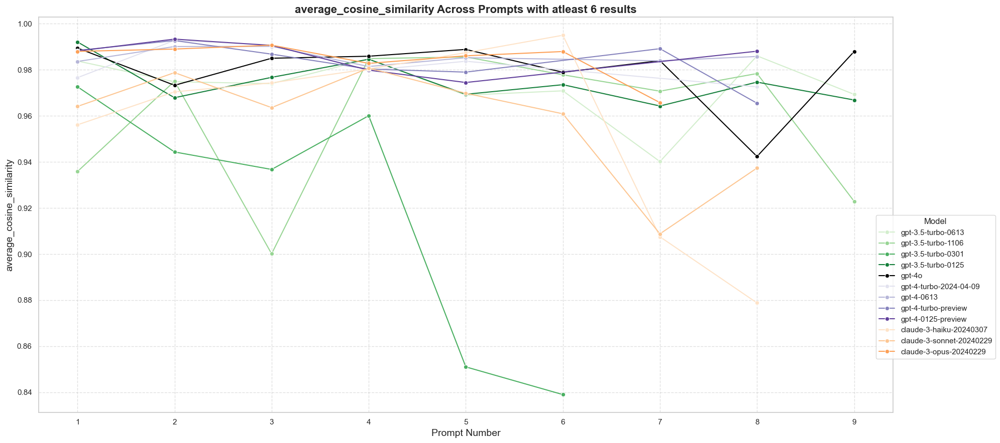

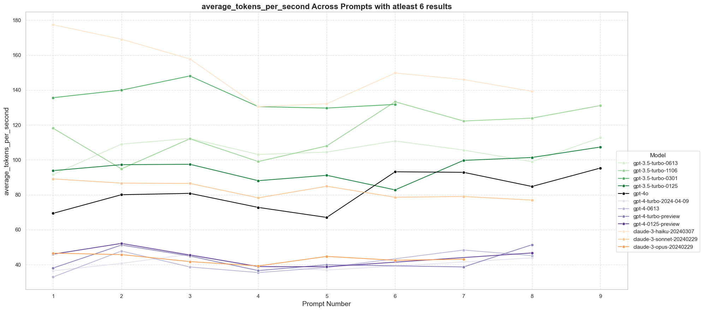

###  Demonstration of LLMs

#### heat-map
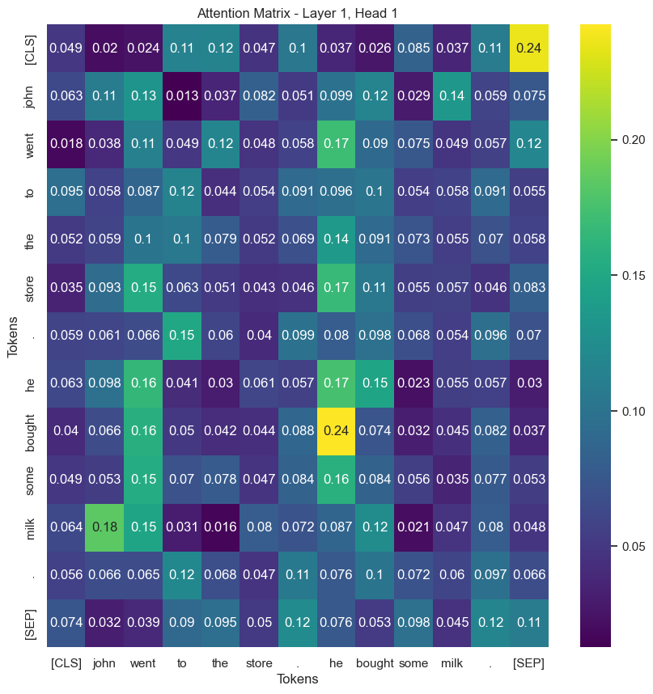

#### attention array
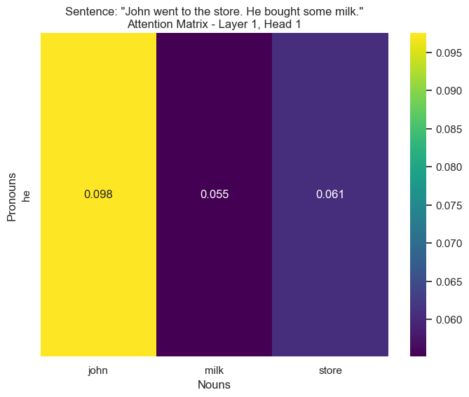

#### attention array
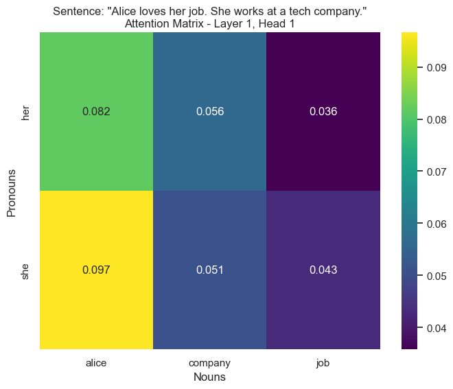

#### attention array
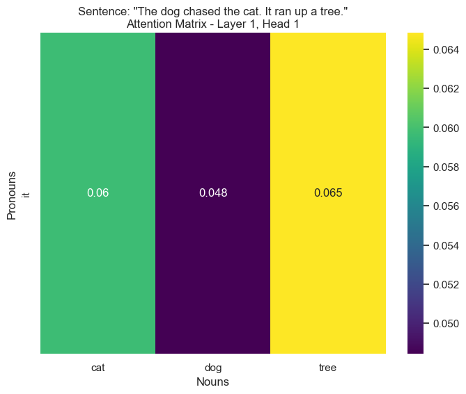
#### attention matrix 
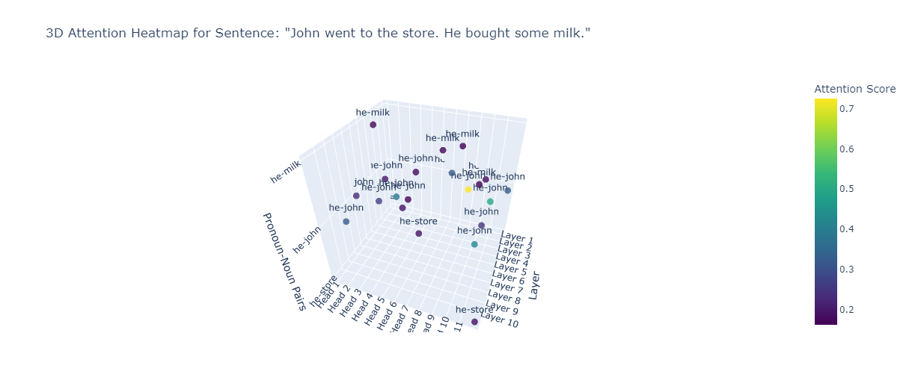

